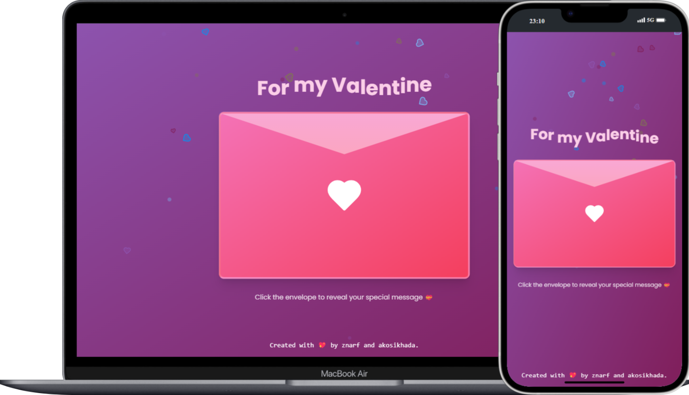

# 💖 Forever Love 💖

A website dedicated to love, crafted with a heartfelt touch for Valentine's Day. Step into a world where romance flourishes, and celebrate the most cherished day of the year with features designed to kindle passion and create unforgettable moments. Forever Love is a digital sanctuary for expressing your deepest affections.

## ✨ Features ✨

- 💖 **Animated Background:** Immerse yourself in a world of romance with a beautifully animated background that sets the perfect mood for love.
- 💌 **Envelop Card:** Send your love notes in a charming digital envelope, adding a touch of classic romance to your heartfelt messages.
- 📝 **Beautiful Message:** Craft and share beautiful, personalized messages that express the depths of your affection.
- 🔒 **Password Protection:** Keep your love notes safe and secure with a password-protected area, ensuring your precious words are shared only with the one you cherish.
- ✨ **Awesome Animations:** Delight in captivating animations that bring the spirit of love to life, adding a touch of magic to every interaction.
- 📱 **Mobile Responsive:** Experience the magic of Forever Love on any device, with a design that adapts seamlessly to phones and tablets, ensuring your love is always within reach.

## 🛠️ Tech Stack 🛠️

  
  
  
  
  
  
  
  
  
  
  
  
  
  

## 📸 Screenshots 📸

  

## 👨‍💻 Authors 👨‍💻

   
  

---

<h3 align="center">Made with ❤️ for Valentine's Day</h3>
